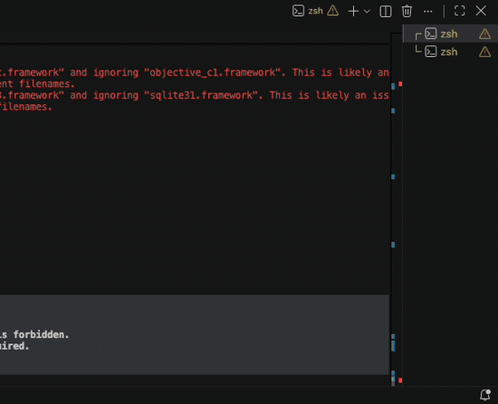

# Kairo

Your AI health companion — an offline-first desktop companion that helps you
build healthier computer habits through an interactive animated character.

Kairo is a native Flutter desktop application. It is not a SaaS, not a web app
and not Electron.

## Demo



## Principles

- **Offline first.** Everything works without a network. No mandatory API calls,
  no cloud storage, no accounts.
- **Privacy first.** All data stays on your machine. Nothing is uploaded,
  tracked or collected.
- **Source available.** Every line is public and readable. Noncommercial use is
  free; see [Licence](#licence).

## Status

Version 1 is in development. The application runs: the dashboard, reminders,
reports and settings are in place, reminders fire on schedule, and the
character walks onto the desktop to deliver them. It packages as a DMG, though
it is not yet signed or notarised. Windows support comes after version 1.

See [docs/architecture/overview.md](docs/architecture/overview.md) for the
design and [docs/adr/](docs/adr/) for the decisions behind it.

No AI ships in version 1. When it arrives it will observe the application, not
drive it — Kairo works completely without a model.

## Install

Requires macOS 13 or later.

**1. Download.** Get `Kairo-<version>.dmg` from
[Releases](https://github.com/azadhmhd/kairo/releases).

Or from a terminal:

```bash
gh release download --repo azadhmhd/kairo --pattern '*.dmg'
```

**2. Install.** Open the DMG and drag Kairo onto the Applications folder beside
it. Eject the disk image when it finishes copying.

**3. Approve it.** Open Terminal and run:

```bash
xattr -dr com.apple.quarantine /Applications/Kairo.app
```

Do not skip this. Kairo is ad-hoc signed rather than notarised, so until you
run it macOS refuses to open the app and says it is damaged. It is not damaged
— that is the wording Gatekeeper uses for any app it cannot trace to a paid
Apple Developer account. You only need to do it once per install.

**4. Launch** Kairo from Applications or Launchpad.

Kairo asks nothing on first run: no account, no sign-in, no network. It starts
with three reminders — water, standing and eye breaks — which you can change or
switch off in Settings.

To uninstall, quit Kairo from the menu bar and drag `/Applications/Kairo.app`
to the Trash.

### Where Kairo lives

**Kairo has no Dock icon.** It runs in the menu bar — look for the leaf, at the
top right of the screen. That is the whole interface while it is working.

- **Menu bar → Open Dashboard** brings the window back.
- **Closing the dashboard does not quit Kairo.** The window goes away and the
  reminders keep running, which is the point of a companion.
- **Menu bar → Quit Kairo** actually exits.

The character walks in from the right edge of the screen when a reminder is
due, and leaves once it is answered. If you would rather it did not, turn it
off in Settings; the reminders continue without it.

## Build from source

- [FVM](https://fvm.app) with Flutter 3.44.7, pinned in `.fvmrc`
- [Melos](https://melos.invertase.dev) for the monorepo

```bash
dart pub global activate melos
fvm install
melos bootstrap
melos run analyze

cd apps/desktop && fvm flutter run -d macos
```

`melos run generate` regenerates everything that is generated — the native
platform bridge from its Pigeon schema, and the database classes from their
Drift tables. Run it after changing either. Generated files are committed, so a
stale one is a build that disagrees with its source.

To build a DMG of your own:

```bash
./scripts/package-dmg.sh
```

It writes `dist/Kairo-<version>.dmg`, taking the version from
`apps/desktop/pubspec.yaml` unless you pass one. Publishing a release is a
separate step:

```bash
gh release create v1.0.0 dist/Kairo-1.0.0.dmg --title "Kairo 1.0.0"
```

## Layout

```
apps/desktop/               The Flutter application
packages/
  kairo_shared_models/      Immutable data shared across the app
  kairo_storage/            SQLite and repositories
  kairo_design_system/      Colours, spacing, type, theme
  kairo_event_bus/          How features talk without knowing each other
  kairo_scheduler/          When something is due
  kairo_workflow_engine/    Triggers, conditions, actions
  kairo_reminder_engine/    Water, stand, eye breaks
  kairo_character_engine/   The character rig
  kairo_desktop_engine/     Windows, overlays, the native bridge
assets/                     Character sheet and application icon
docs/                       Architecture and decision records
scripts/                    Packaging
```

## Licence

[PolyForm Noncommercial 1.0.0](LICENSE). Copyright © 2026
[Azad Mohamed](https://github.com/azadhmhd).

Read it, run it, fork it, learn from it, contribute to it — any noncommercial
use is free and needs no permission. Selling Kairo or a derivative of it does
need permission; open an issue.

This makes Kairo **source-available rather than open source**: the Open Source
Definition does not allow a licence to restrict commercial use.
[ADR-0006](docs/adr/ADR-0006-licence.md) records why.
